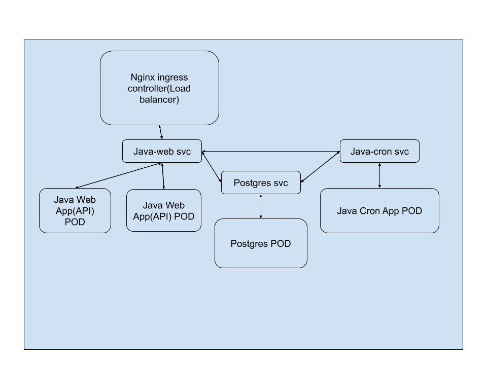

# Welcome to k8s setup for EMS assignment
## Assignment Details -
1) Design and develop simple springboot application for Employee Management System

  a. Use JWT for rest security
  
b.      Design ER Diagram for Employee And Department

c.       CRUD operation for Employee & Department

d.      Use Hibernate, JPA

2) Design and develop simple springboot application for scheduler using (CRON) expression to call external rest service         

a.       Create a batch scheduler (CRON )which will give me the list of employee with their current employment status at every night at 10:00 PM. 

3) Build a docker Image of this application & deploy that on Kubernates

a.       Application should be scalable

b.      Use load balancer (nginx)

4) Use postgreSQL as DB

a.       DB should be in K8 cluster


#### Features

I should get total Employee list with their current employment status (active / inactive ) at every night at 10:00 PM 
Employee

  Personal Inforamtion
  Address Details
Active / InActive (current / ex employee)

Department
  HR
  R&D
  Marketing
  Account


---
Github repos for both java applications -
[Java web app](https://github.com/gslab-project/java-web-app)
[Java cron app](https://github.com/gslab-project/java-cron-app)

## k8s cluster


## Prerequisite
- Install minikube to create cluster on VM.
- Install kubectl

## Steps to create k8s cluster
3 steps -
- Dockerize the applications using dockerfile
- build and push image on dockerhub
- create yaml files for all micro services

## Dockerfile

There are 3 docker images for this assignment -
- Postgres 
  
  Use the public docker image available on dockerhub for [postgres](https://hub.docker.com/_/postgres).
  
- Build and push docker images for Java web app & Java cron app.

  For java app, build docker image on top of [`openjdk:8-jre-alpine`](https://hub.docker.com/_/openjdk) as and when we commit code.

## Build docker image for application
Build image - `docker build -t sagargslab/java-web-app:<version>` to create image.
Push to dockerhub - `docker push sagargslab/java-web-app:<version>`

## k8s yamls
#### k8s yaml for Postgres container
- [ConfigMap](https://github.com/gslab-project/k8s/blob/master/postgres-configmap.yaml)
Configmap contains external configuration for system. Like db name, host name, port.
- [Secret](https://github.com/gslab-project/k8s/blob/master/postgres-secret.yaml)
Used to store secret data. Like username & password needs to be encoded using base64.
Encode any value on terminal like this -> `echo -n "yourpassword" | base64`
- [PersistentVolume](https://github.com/gslab-project/k8s/blob/master/postgres-storage.yaml)
Pods are stateless. It means when pod is down, it looses all its data. We need to keep data persisted though pod up or down.
- [Deployment](https://github.com/gslab-project/k8s/blob/master/postgres-deployment.yaml)
Docker containers is running application. And it is bind inside Pods. Pods are created using deployment.
- [Service](https://github.com/gslab-project/k8s/blob/master/postgres-service.yaml)
Pod contains IP for communication between other pods. But This is temporary IP and when pod restarts then it gains new IP.
Services allows us to have permenent IP.

### k8s yamls for [Java web app](https://github.com/gslab-project/k8s/blob/master/java-web-deployment.yaml) & [Java cron app](https://github.com/gslab-project/k8s/blob/master/java-cron-deployment.yaml)
It is divided into 2 parts -
- Deployment
Deployment creates pods using docker image.
- Service
Its permenent IP used for communication between pods.

### k8s yaml for ingress
Ingress is used for make external service to access using browser.
Important keys for ingress -
- host- java-web-app.com
- serviceName: java-web-service
- servicePort: 8080

Now the service will be accessible using java-web-app.com on browser.
To make it work we need to add minikube node ip into /etc/hosts.
Check IP using command - `minikube ip`
Map IP to name in `/etc/hosts` file as shown below.
`<minikube ip> java-web-app.com`

---
Now the when all files are ready then we can create cluster using below commands inside floder where all yamls resides.
```
kubectl create -f postgres-secret.yaml
kubectl create -f postgres-configmap.yaml
kubectl create -f postgres-storage.yaml
kubectl create -f postgres-deployment.yaml
kubectl create -f postgres-service.yaml
kubectl create -f java-web-deployment.yaml
kubectl create -f java-cron-deployment.yaml
kubectl create -f ingress.yaml
```
Here the sequence is very important.

